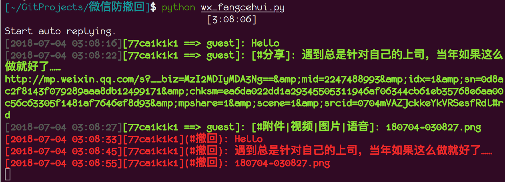
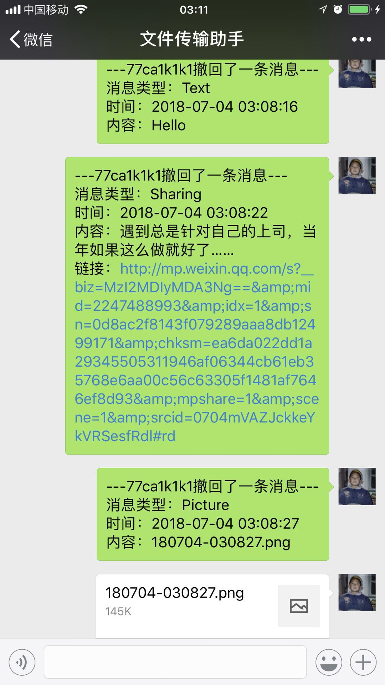

## 微信防撤回脚本
- Python3
- 基于itchat(pip3 install itchat)

## 准备
itchat, termcolor
```
pip3 install -r requirements.txt
```

## Demo
### 运行脚本监听正常发送的消息和撤回的消息

### 手机上相应的截图



## 参考
- https://segmentfault.com/a/1190000015428118
- https://www.jianshu.com/p/712d19374b2e
- https://mp.weixin.qq.com/s/ChPALrUQ1Hh181YLAwSWXQ
